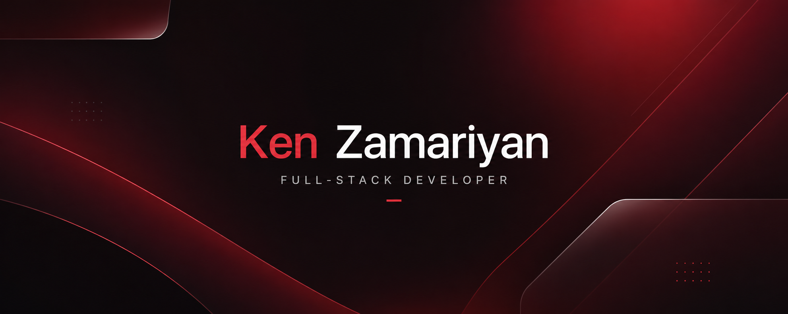

 

# Ken Zamariyan

### Full-Stack Developer

Building scalable web and mobile products with modern JavaScript technologies.

 

  
  &nbsp;&nbsp;&nbsp;
  
  &nbsp;&nbsp;&nbsp;
  

---

## About

I build modern digital products that combine thoughtful user experiences with scalable engineering.

From web applications to mobile platforms, I focus on delivering reliable, maintainable, and business-driven solutions using modern JavaScript technologies.

---

## Technologies

<table>
<tr>

<td align="center">

### Frontend

 

React • Next.js • TypeScript • Tailwind CSS • Vite

</td>

<td align="center">

### Backend

 

Node.js • Firebase • REST APIs

</td>

<td align="center">

### Mobile

 

React Native • Expo

</td>

</tr>
</table>

 

 

Git • GitHub • VS Code • Postman • NPM

---

## Philosophy

> Great software is not defined by complexity. It is defined by clarity, reliability, maintainability, and the value it creates for users.

I focus on building scalable systems, delivering practical solutions, and creating products that provide long-term business value.

---

### Connect

 

  
  &nbsp;&nbsp;&nbsp;
  
  &nbsp;&nbsp;&nbsp;
  

Building Digital Products That Scale

